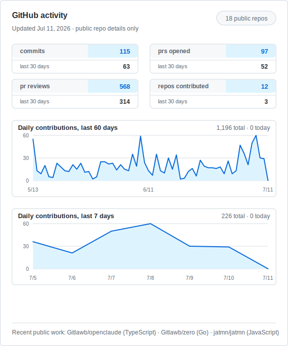

# JATMN

  
  
  
  

Builder, reviewer, and open-source tinkerer in SoCal. I spend most of my time around coding agents, provider compatibility, review automation, 3D-printing tooling, and the occasional game or modding side quest.

## Current Focus

- Shipping practical coding-agent workflows that survive real repositories.
- Reviewing PRs with an eye for correctness, safety, test coverage, and whether the change is actually worth merging.
- Building and maintaining tools across TypeScript, Rust, C++, Lua, and shell-heavy automation.
- Keeping local-first workflows sharp before turning them into public infrastructure.

## Workbench

  
  
  
  
  

