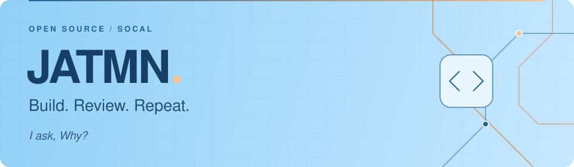
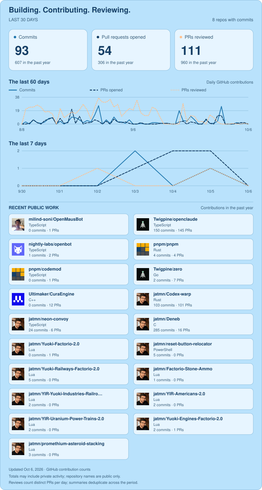

**👋 Hey, I’m JATMN — builder, reviewer, and open-source tinkerer in SoCal. 🌴**

I work on coding agents, provider compatibility, and review automation. Also on the workbench: 🖨️ 3D-printing tooling, 🎮 games, and the occasional modding side quest.

## 🛠️ On my workbench

**🤖 Coding agents & automation** 
Practical workflows that hold up in real repositories, with local-first tools at the center.

**🚀 Open-source contributions** 
Writing code, opening PRs, and reviewing changes — with an eye for correctness, safety, and useful tests.

**🧩 Tools & tinkering** 
Building and maintaining developer tools, exploring 3D printing, and following the occasional side quest.

### ⚙️ Tools I reach for

`TypeScript` · `Rust` · `C++` · `Lua` · `Shell` · `GitHub Actions`

## 📈 What I’ve been shipping

💻 Commits, 🚀 pull requests, and 🔎 reviews — a look at what I’ve been building and contributing.

